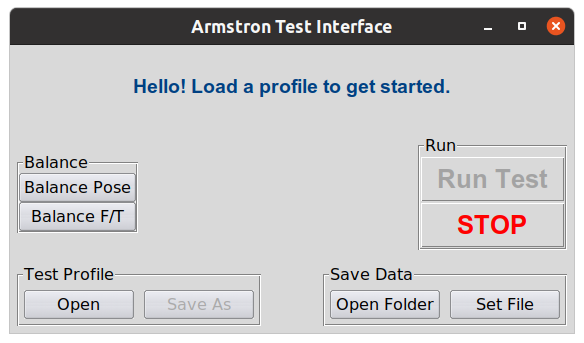
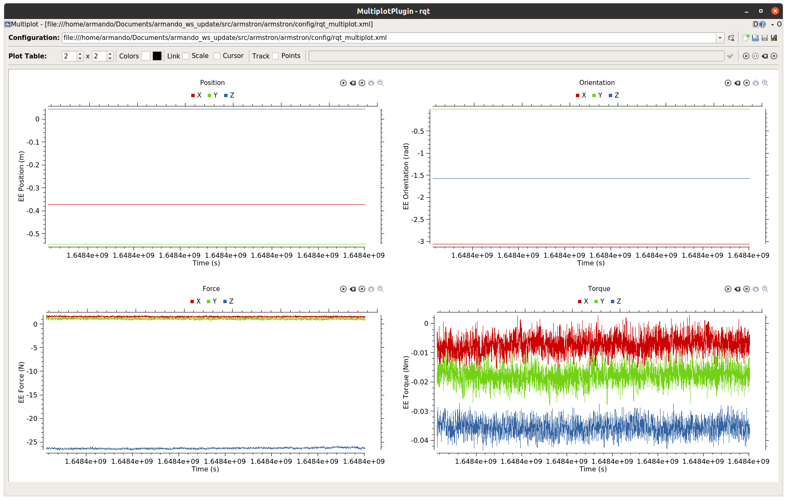
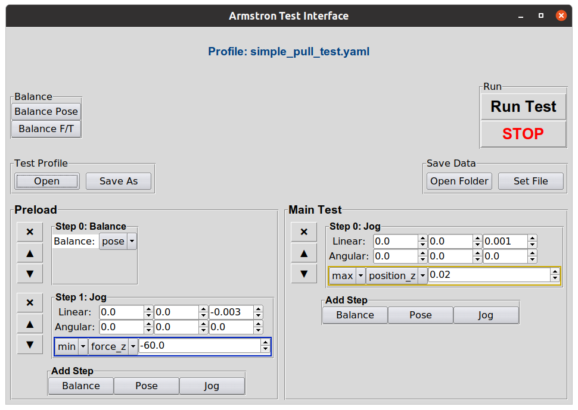

.. _gui_test:

.. |up|   unicode:: U+25B2 .. UP
.. |dn|   unicode:: U+25BC .. DOWN
.. |x|    unicode:: U+274C .. X

==========
Run a Test
==========

Lets walk through the easy way to build and run tests.

.. contents:: Contents:
    :local:
    :depth: 1

Startup
_______

1. Bringup the robot
    a. *(Teach Pendant)* Turn on the robot, get into _manual_ mode, then load the "EXTERNAL_CONTROL.urp" program.
    b. *(Teach Pendant)* Start the robot (tap the small red dot on the bottom left corner)

2. Start Armstron
    a. *(Host Computer)* Choose “Armstron” from your application menu (Super + A).

Now the Armstron GUI and a live graph will open:

Build a Test Profile
____________________

1. Click the "Load" button and choose an existing profile
2. Use the |up| and |dn| buttons to move a step up or down
3. Use the |x| button to remove a step
4. Add a step with the "add step" buttons.

Run a Test
__________

1. *(Teach Pendant)* Move the arm around manually to set things up.
2. *(Teach Pendant)* Once you are ready to test, run the "EXTERNAL_CONTROL.urp" program. (press "play" in the bottom bar)
3. *(Host Computer)* Choose where to save data with the "Set File" button.
4. *(Host Computer)* Run a test using the "Run Test" button.
5. *(Host Computer)* Abort a test using the "STOP" button. *Note: Data is saved continuously during tests, so your data is safe even if a test gets aborted.*

.. note::
    
    Savefile names are auto-incremented to prevent overwriting of data, so you only need to set the filename once.

.. important::
    
    **Don't forget to run the "EXTERNAL_CONTROL.urp" program** before running tests! It's easy to forget, so let this note serve as a reminder.

Happy Testing!
______________

This is all you really need to know to use the Armstron. If you are interested in doing more-advanced things, keep reading in :ref:`Manual Testing <manual_test>` section